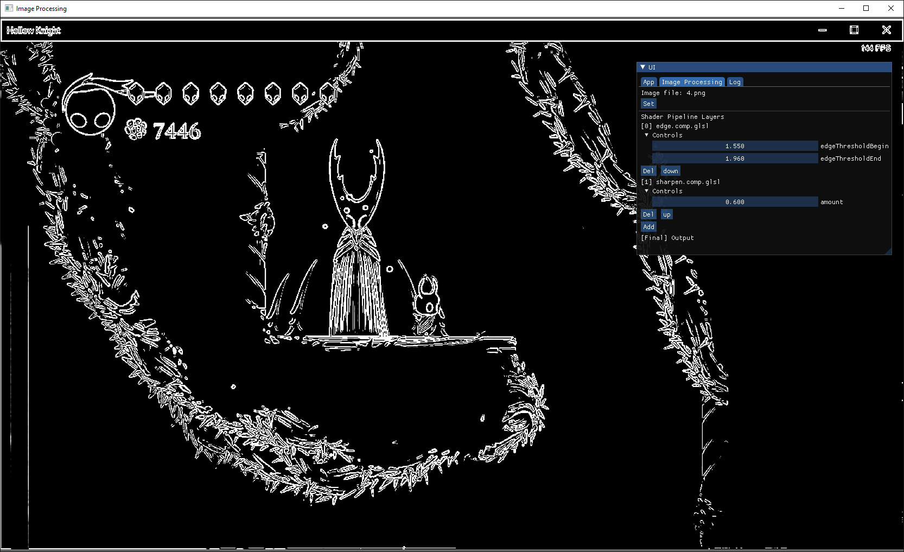

# ImageProcess
A platform to try compute shader filter for image post-processing methods

Now supporting multiple compute shader image filters as a pipeline  
For example:  
```
[0] edge detection filter (compute)
[1] sharpen filter (compute)
[Final] output (vertex-fragment)
```
Orders can be modified

------

### Build

```bash
git submodule update --init --recursive
mkdir build && cd build
cmake ..
make -j4
```

Or (if there's no `make`)
```powershell
cmake --build . --config Release
```

------

### Requirements

* C++ compiler supporting cpp11  
* GPU supporting OpenGL 4.5  

------

### Usage

* `R` to reload shader file  
* `F12` to toggle UI display  

------

### Demo


